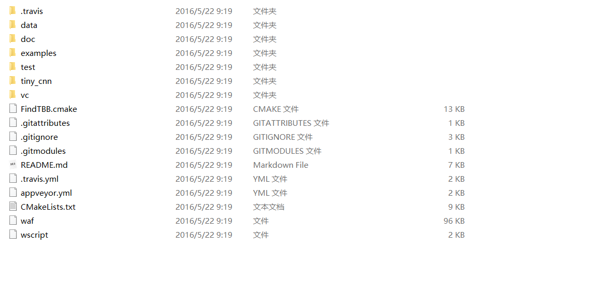
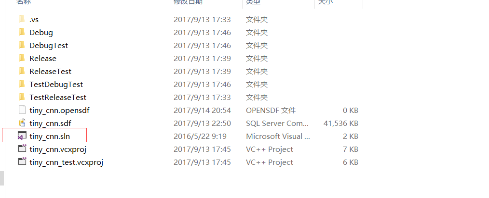
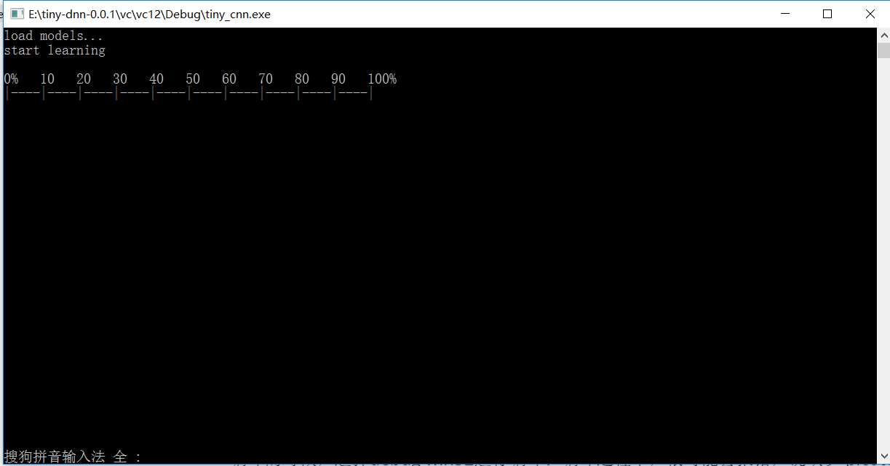
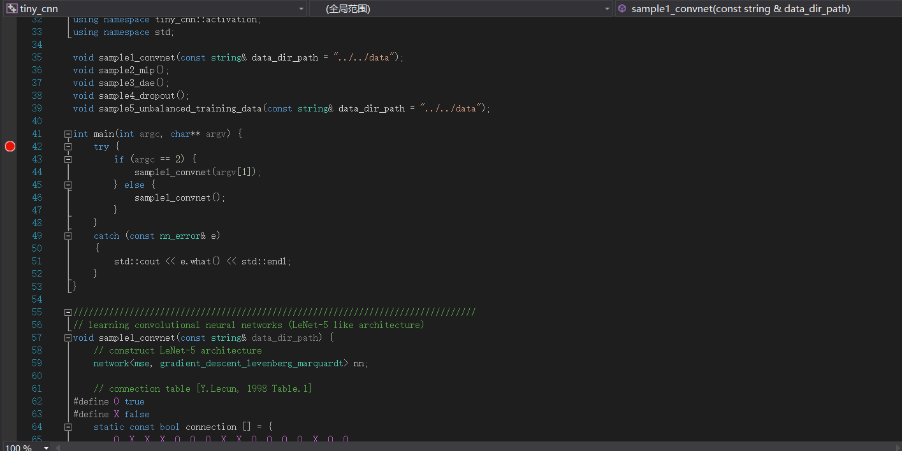

## tiny-cnn

最近在看caffe源码，看得有点吃力，可能还是因为c++的基础不够。上知乎的时候发现有一个轻量级别的cnn框架，称为tiny-cnn，不过经过多个版本的更迭，现在已经取名为tiny-dnn，增加了包括RNN在内的多种神经网络。这个框架也是用c++写的，依赖很少，号称只要引用头文件就可使用的框架。于是我打算开始阅读这个开源代码，一方面帮助自己熟悉cnn算法的实现，另外一方面也可以提高c++的水平。

## 一、在vs中配置

### 下载源码

首先，到github上下载源码，我是打算从最初的版本看起，所以下载了最开始的版本。下载地址：https://github.com/tiny-dnn/tiny-dnn

### 打开解决方案

下载好的源代码文件夹中，有一个vc文件夹，vc文件夹里面又有两个文件夹，分别为vc12和vc14，这里选用vc12，因为我用的是visual studio2015，在用vc14的时候总是各种报错，无法编译。所以选择vc12。

### 编译

编译的时候，选择debug win32进行编译。编译过程中，很可能会报错，说缺少 picotest/picotest.h文件，到tiny-dnn-0.01/test/picotest文件夹中一看，发现果然没有picotest.h文件，网上查找之后，才找到了picotest文件夹，下载地址：https://github.com/nyanp/picotest，下载好之后，将picotest.h文件放入test/picotest文件夹中，再次编译，顺利通过。

### 运行

编译完之后直接运行，如果出现以下画面，则说明程序可以顺利跑通。

### 调试

在test_cnn项目中，有一个main.cpp文件，打开，发现里面有一个main函数，在main函数中打上断点，就可以开始跟着调试来看代码了！接下来，我回不断更新自己阅读这个源码过程的理解。

## 二、在linux中配置

使用clion IDE

将tiny-cnn文件夹加入到clion的工程目录下，然后在CMakeLists.txt中将这个文件夹include进来就好，因为没有任何的源文件，所以可以这么做。

~~~cmake
cmake_minimum_required(VERSION 3.8)
project(tiny_cnn)
set(CMAKE_CXX_STANDARD 11)
include_directories(/home/mensaochun/CLionProjects/tiny-cnn)
set(SOURCE_FILES main.cpp)
add_executable(tiny_cnn ${SOURCE_FILES})
~~~

然后建立一个main.cpp 文件，将example下的mnist train.cpp文件中的内容copy到这里，稍作修改，就可以运行了！

